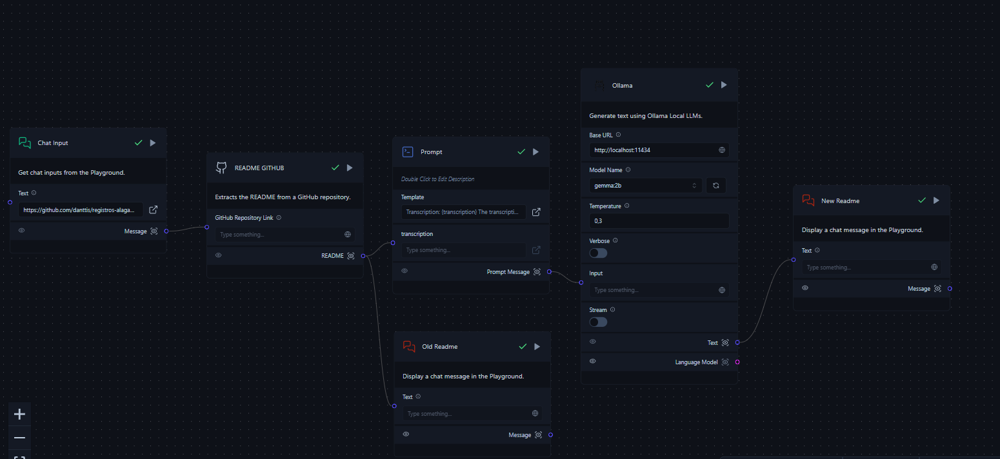

# README-Update-Langflow

Como importar o projeto: https://docs.langflow.org/administration/collections-projects

## README-Update-Langflow (Exemplo de entrada)
Esse repositório usa uma LLM para analisar README do GitHub e gerar um melhor usando Langflow

Como usar:
Escolha o repositório
coloque link no Agent
Veja o resultado e ajuste conforme o necessario

## Exemplo de Saída
**Lembre-se de substituir "repositório" pelo nome do seu repositório.**

**Passo 1: Escolha o repositório**

Selecione o repositório que deseja otimizar.

**Passo 2: Coloque o link do agente**

Coloque o link do repositório no agente.

**Passo 3: Visualize o resultado**

Visualize o resultado da otimização na tela. O resultado deve conter as seguintes informações:

* Uma descrição do repositório
* Um link para o repositório
* Uma imagem de exemplo do repositório
* Uma lista de exemplos de uso

**Passo 4: Ajuste conforme necessário**

Utilize as opções de ajuste disponíveis para otimizar o resultado, como:

* Adicionar exemplos de uso
* Adicionar emojis
* Adicionar texto explicativo
